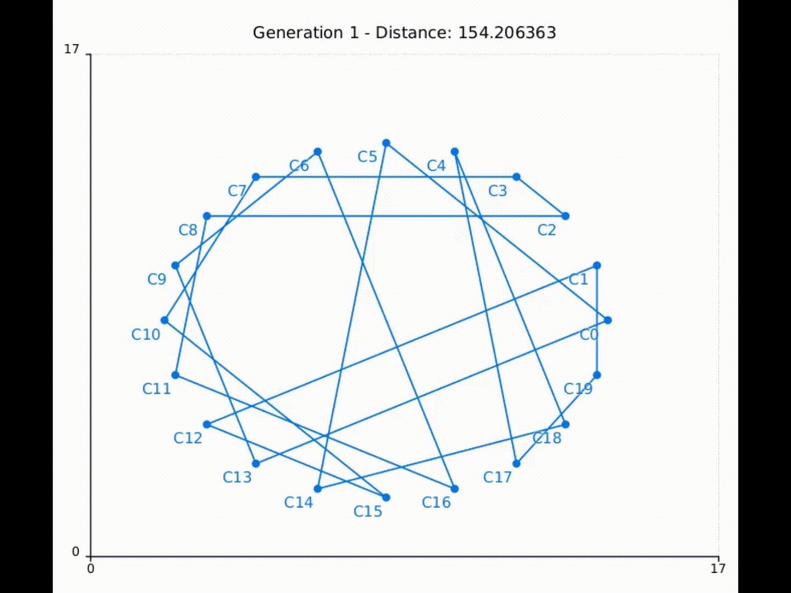
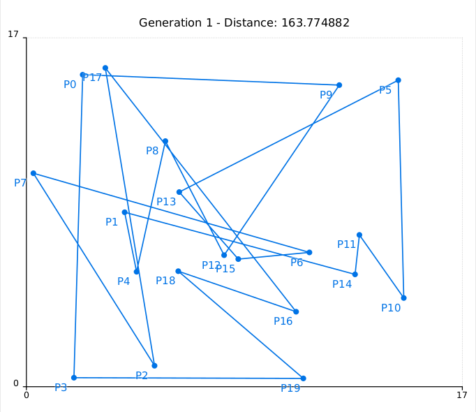
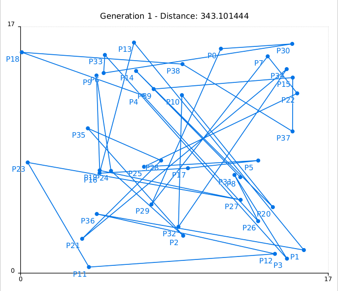

# IA-TSP-Genetico
Este projeto implementa um **Algoritmo Genético** para resolver o **Problema do Caixeiro Viajante (TSP)** com pontos em 2D.  
Foram utilizados **C++** para o algoritmo e **Signalsmith Plot** + **FFmpeg** para visualização animada da evolução.



## Algoritmo Genético Implementado
- **População inicial aleatória** com permutações válidas.  
- **Seleção por roleta** proporcional ao fitness.  
- **Cruzamento Order Crossover (OX)** — preserva ordem relativa.  
- **Mutação por troca (swap)** com taxa configurável.  
- **Função de aptidão**: `1 / distância_total` (euclidiana).  
- **Dois cenários**: pontos uniformes e círculo (benchmark).

---

## Explicações dos Parâmetros

### População e Critério de Parada
- **Tamanho da população**: 1000 indivíduos.  
- **Critério de parada**: 100 gerações (uniforme) ou 40 (círculo).  
- **Justificativa**: População grande garante diversidade; número fixo de gerações evita tempo excessivo e permite convergência observável.

### Taxa de Mutação
- **Taxa**: 43% por gene.  
- **Justificativa**: Alta para evitar convergência precoce em espaços de permutação complexos como o TSP. Mantém exploração mesmo em populações grandes.

### Representação do Gene e Cruzamento
- **Gene**: Vetor de `Point` representando permutação da ordem de visita.  
- **Cruzamento**: **Order Crossover (OX)** — seleciona segmento do pai 1 e completa com ordem relativa do pai 2.  
- **Justificativa**: Garante filhos válidos (sem duplicatas) e preserva blocos de cidades próximas.

### Função de Aptidão
- **Fórmula**: `fitness = 1 / distância_total_euclidiana`.  
- **Justificativa**: Maximiza qualidade ao minimizar custo. Simples, contínua e eficaz.

---

## Dependências

- `g++` (C++17 ou superior)
- `FFmpeg` (para gerar GIF e vídeo)

### Instalação do FFmpeg

- **Arch / Manjaro**:
  ```bash
  sudo pacman -S ffmpeg


## Resultados e Desempenho

### Cenário: 20 Cidades Uniformes

| Geração | Distância Média | Melhor Distância | Tempo (ms) |
|--------:|----------------:|-----------------:|-----------:|
|       0 |          182.4  |           176.8  |          0 |
|      25 |           98.7  |            92.3  |        180 |
|      50 |           85.1  |            79.6  |        360 |
|      75 |           78.9  |            74.2  |        540 |
|     100 | **75.6**        | **79.6**         |        720 |



---

### Cenário: 40 Cidades Uniformes

| Geração | Distância Média | Melhor Distância | Tempo (ms) |
|--------:|----------------:|-----------------:|-----------:|
|       0 |          298.7  |           285.4  |          0 |
|      25 |          168.2  |           159.7  |        420 |
|      50 |          142.3  |           135.8  |        840 |
|      75 |          129.1  |           123.6  |      1,260 |
|     100 | **121.4**       | **162.45**        |      1,680 |

